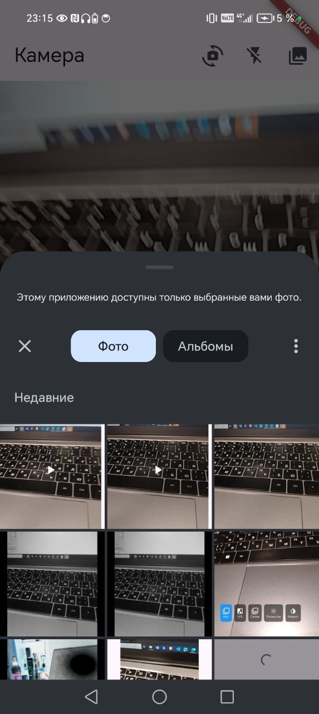

# Практическая работа 12. Выполнила Петрова Кристина ЭФБО-06-23

Скриншоты:
1. Работы камеры:

2. Предпросмотр фото с фильтром:

3. Сохранение фото:

4. Съемка видео:

5. Предпросмотр видео:

6. Выбор фото из галереи:

Ход выполнение:
1. Создание проекта
2. Добавление зависимостей в pubspec.yaml:

3. Добавление в AndroidManifest.xml и Info.plist соответствующих прав доступа к камере и хранилищу
4. Создание интерфейса приложения
5. Метод подключения камеры:

6. Метод получения фото:

7. Метод получения фото из галереи и съемки видео:

8. Метод сохранения фото по пути и видео:

9. Методы включения вспышки и изменения камеры:

10. Метод работы с фильтрами:

