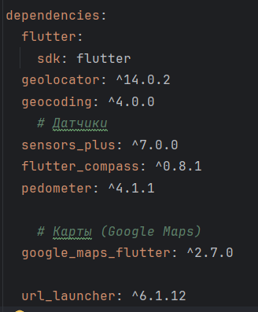
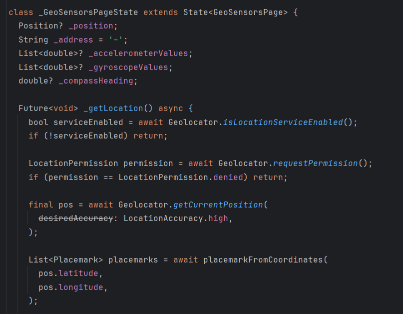

# Практическая Работа 13.

Выполнила Петрова Кристина ЭФБО-06-23

Цель работы: изучить работу с аппаратными датчиками и сревисами устройства и освоить получение координат при помощи геолокации.

Ход работы:
1. Установка пакетов:

2. Добавление зависимостей в AndroidManifest.xml:
3. Получение данных о локации:

4. Работа с датчиками:

5. Написание пользовательского интерфейса:

Скриншоты работы приложения:

Результаты и выводы:
Было написано приложение для работы с геолокацией и датчиками мобильного устройства.

Проблемы:
1. При попытке создания отображения расположения пользователя на карте Яндекс возникли проблемы с совместимостья версии SDK.
2. На мобильном устройстве изначально плохо работает компас и гироскоп.