# Практическая работа 11

## Выполнила Петрова Кристина ЭФБО-06-23.

Ход работы:
1. Настройка проекта и зависимостей

2. Создание модели данных (/lib/models/note.dart)

3. Реализация API-клиента с ретраями (lib/data/api_client.dart)
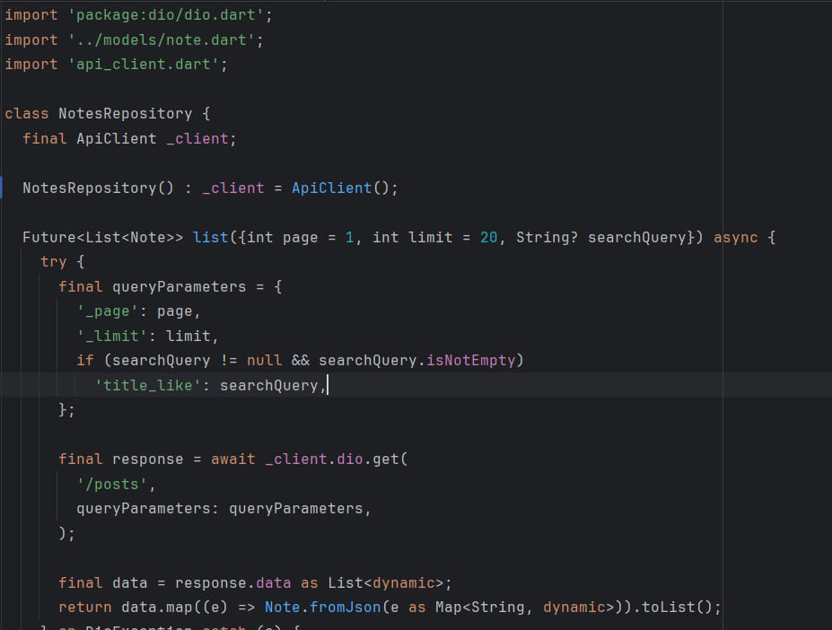

4. Создание репозитория с методами CRUD (lib/data/notes_repository.dart)

5. Реализация основного экрана с пагинацией и поиском (lib/pages/notes_page.dart)

6. Создание экрана с деталью заметки
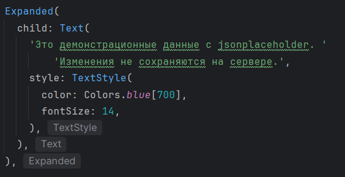

Скриншоты:
- Экран списка:
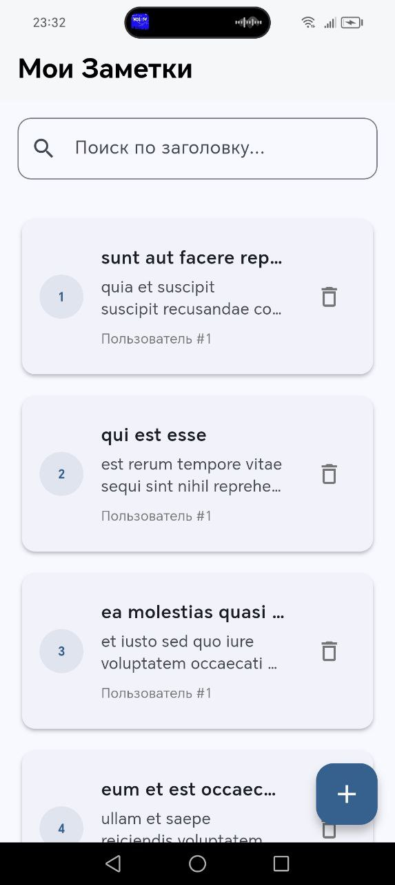
- Экран деталей:
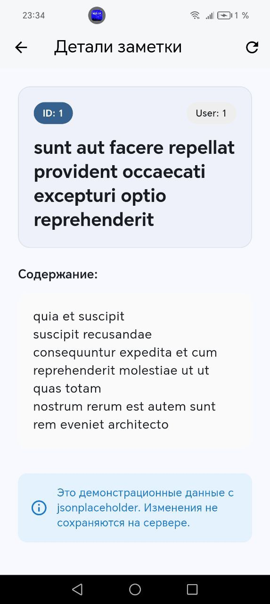
- Диалог создания и результат:
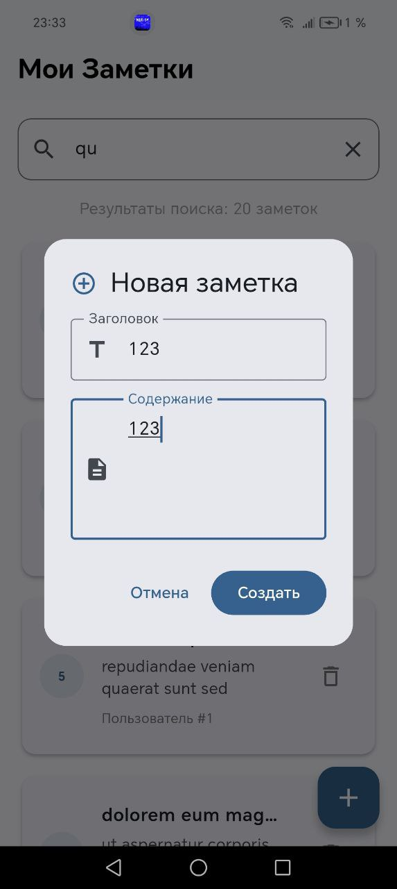
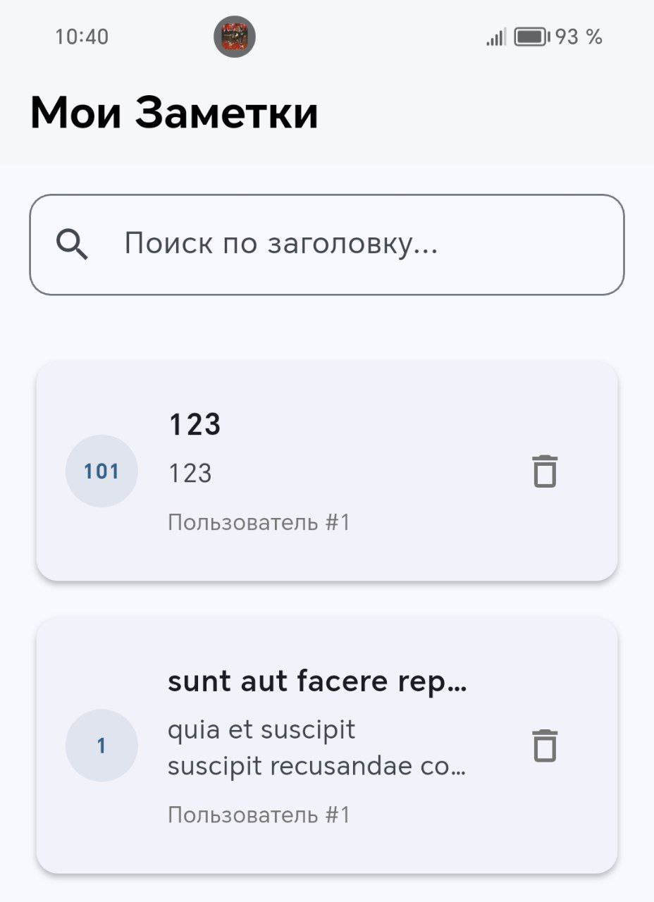
- Удаление заметки:
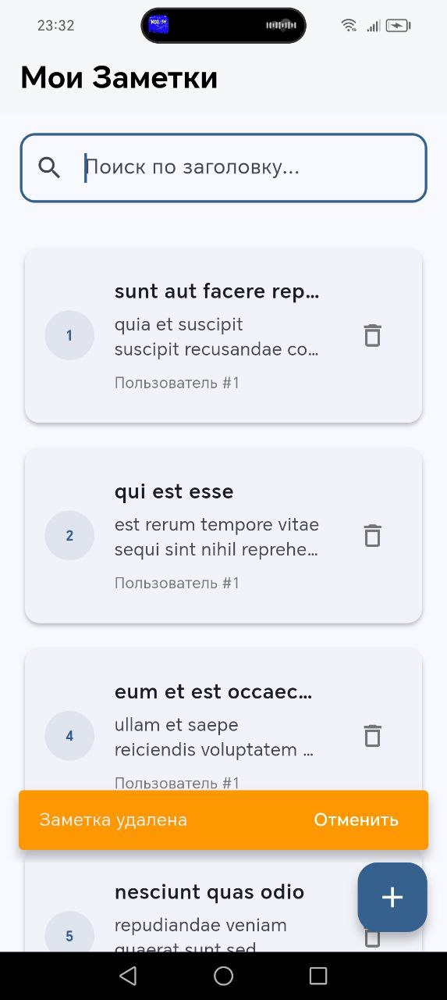

Дополнительно:
- Поиск:
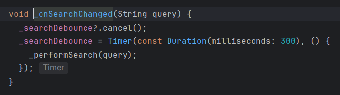
- ретраи c экспоненциальной паузой:
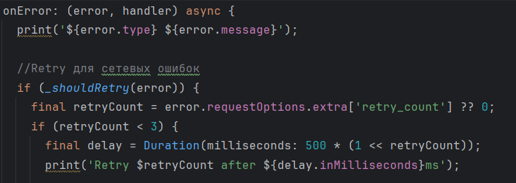
- Undo на удаление:
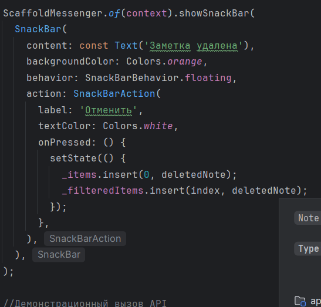
- Pull-to-refresh (notes_page.dart):
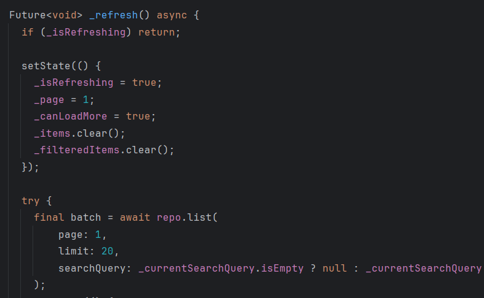
- .env
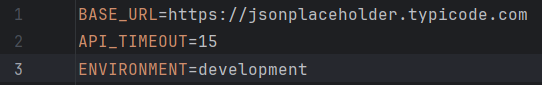

Крактий отчет:
- Вариант A - JSONPlaceholder API
- Базовый URL: https://jsonplaceholder.typicode.com
  - GET /posts - получение списка заметок
  GET /posts/{id} - получение конкретной заметки
  POST /posts - создание заметки
  PATCH /posts/{id} - обновление заметки
  DELETE /posts/{id} - удаление заметки
- Модель включает конструктор fromJson для преобразования JSON в Dart-объекты.
- Репозиторий инкапсулирует всю логику работы с API, обеспечивая разделение слоёв данных и UI.
- Пагинация: бесконечная прокрутка с подгрузкой по 20 элементов, параметры запроса: _page и _limit, автоматическая подгрузка при достижении конца списка.
- Таймауты: 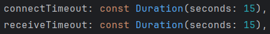
- UX состояния: Loading: индикатор прогресса при первичной загрузке 
                Empty: сообщение при отсутствии данных
                Error: SnackBar с описанием ошибки и возможностью повтора 
                Data: отображение списка с пагинацией

