# Практическая работа 14.
## Выполнила Петрова Кристина ЭФБО-06-23.

За основу работы взята 10 практика.

Шаги выполнения:
1. Подготовка: установка зависимостей

flutter analyze:

3. Cоздание unit-тестов:

Запуск тестов:

4. Создание Widget-тестов:

Запуск тестов:

5. Интеграционные тесты:
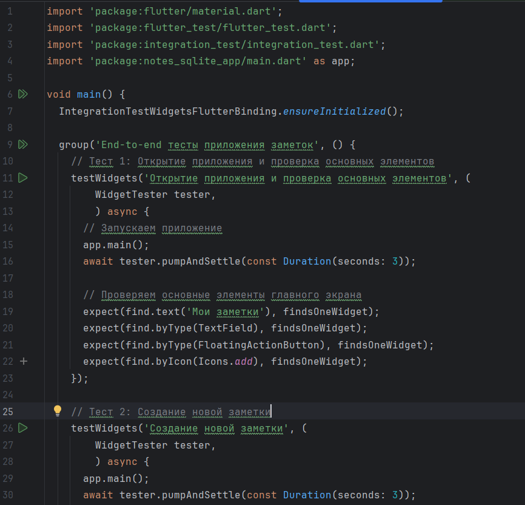
Запуск тестов:
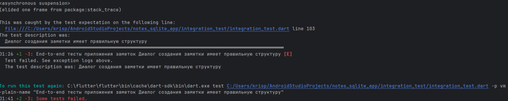
6. Профилирование:
В режиме профильной сборки:
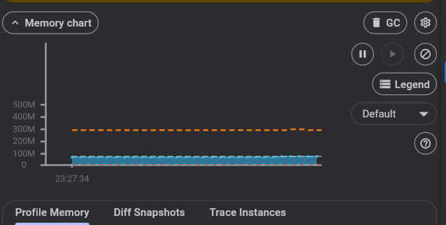
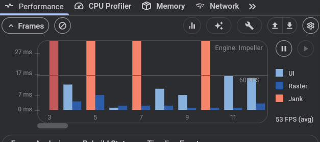
7. Оптимизация:
   - В первоначальном коде использовался простой ListView.builder. После стал использоваться ListView.builder с itemExtent, cacheExtent и пагинацией
   - До этого не было ключей для виджетов. Добавлен stable key для виджетов, чтобы корректно определялись какие элементы обновились пи обновлении списка
   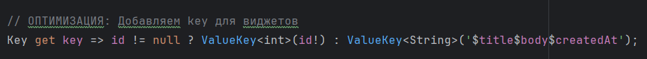
   - Виджеты были разделены на мелкие виджеты.
   - Была добавлена индексация и пагинация в бд.
   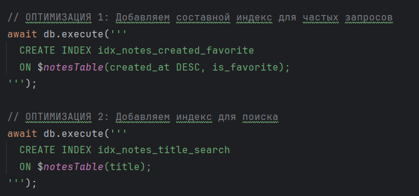
   - Добавлена оптимизированная сериализация.
   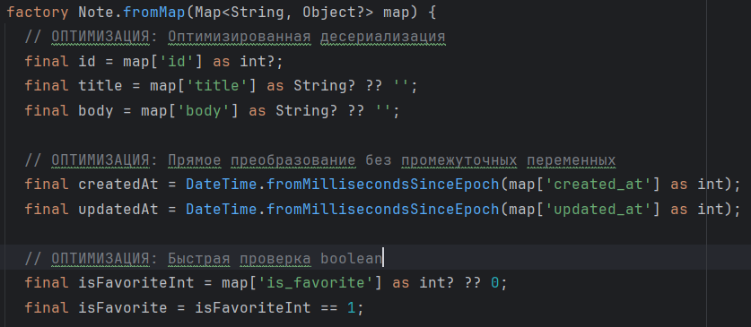
8. Анализ размера приложения:
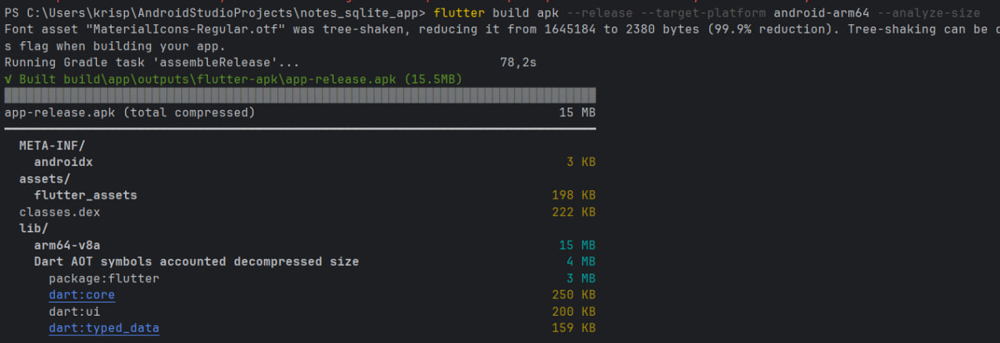
Меры снижения размера:
   - 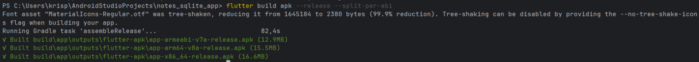
   - Также были удалены ненужные шрифты и ассеты.
После снижения размера:
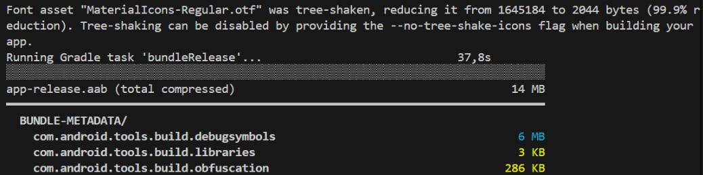
9. Обработка ошибок:
Создание глобальных перехватчиков в main.dart:
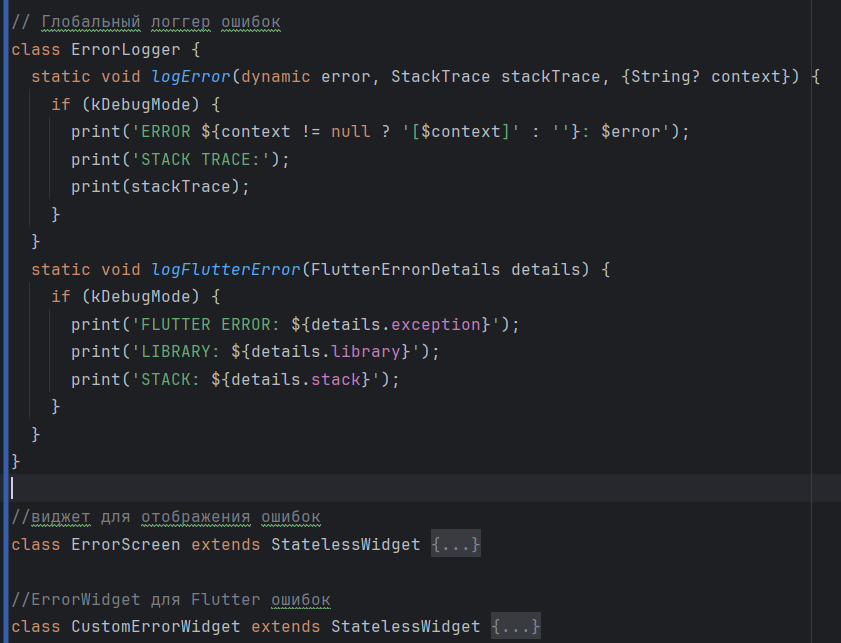
Виджет отображения ошибки:
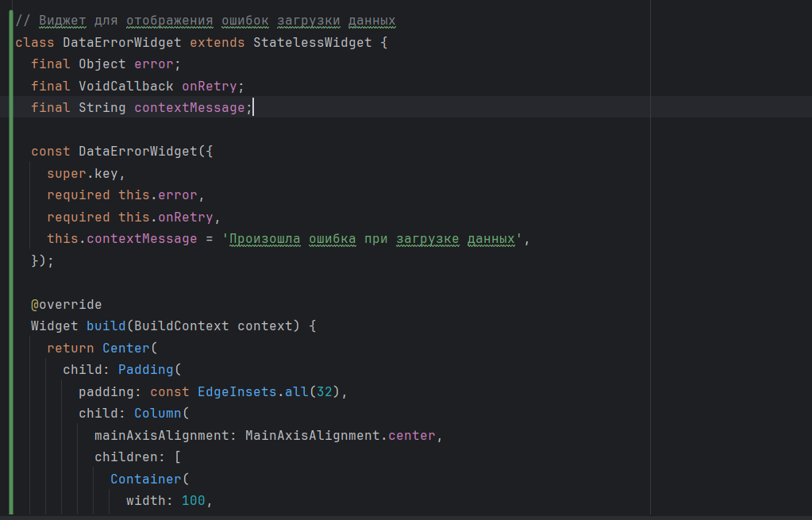
Экран с ошибкой и деталями:

Ошибка flutter:
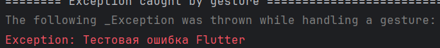
